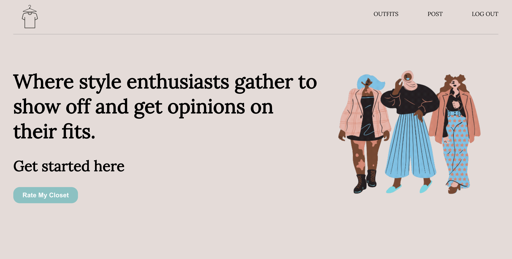
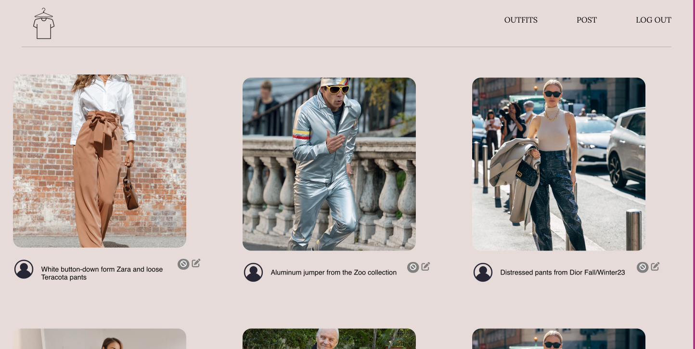

# Rate My Closet

*Rate My Closet* is a platform that provides users the answer to the age-old question “How do I look?”. As a user you can log in and upload a photo of their outfit. Users are able to create, edit, and delete their outfit posts. You are also able to view other people outfit posts in the main feed. The comment and rating feature are still under construction, but once complete, a user will be able to comment and rate other people’s outfits.

## Getting Started 🚦
## [Link to app here!](https://rate-my-closet.netlify.app/)
### [Link to planning materials](https://trello.com/b/jHKIh1ii/rate-my-closet)

## Technologies used 🛠️
* TypeScript
* JavaScript
* Node.js
* React.js
* Sequelize
* PostgreSQL
* Express
* HTML
* CSS
* Vite
* git
* fly.io
* Netlify

## Credits 🙌
* [Fontawesome](https://fontawesome.com/icons)
* [Google Fonts](https://fonts.google.com/)
* [Canva](https://www.canva.com/)

## Next steps🧊
- [ ] User is able to execute full CRUD on comments and ratings.
- [ ] Users are able to view their own profile page containing their own posts.
- [ ] Users are able to add outfits to their favorites list.
- [ ] Users are able to tag links on the uploaded outfit pic to where you can purchase articles of clothing and accessories.
- [ ] Improve on styling and responsive/ mobile friendly design.
